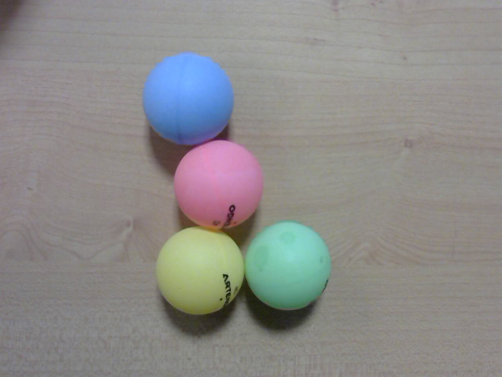

# TP Couleur

L’ensemble des comptes rendus est à rendre sous gitlab. Le travail est à effectuer en binôme. Une séance plus un peu de temps en plus doit suffire. 
Le travail est à faire en autonomie par binôme. Le but est de s’habituer à travailler en consultant des ressources pertinentes sur internet en cas de besoin. L'usage de chaptèGPT est permis par contre, vous devrez fournir votre prompt de session (lien url fourni par chat-gpt par exemple). Il est fortement conseillé de ne pas copier/coller les codes mais de les retaper pour laisser à cvotre cerveau le temps de les assimiler

## Objectif

On s’intéresse au tracking par un drone volant d'une boule de couleur, c'est-à-dire aux technologies permettant le comportement suivant :  
[Vidéo du comportement](https://www.youtube.com/watch?v=_3697dtyOz4)

Le fichier [balls_tracker.py](couleur/balls_tracker.py)
contient un exemple de code ( associé à un ensemble de vidéos.)
``` python
#!/usr/bin/env python

'''
Track a green ball using OpenCV.

    Copyright (C) 2015 Conan Zhao and Simon D. Levy

    This program is free software: you can redistribute it and/or modify
    it under the terms of the GNU Lesser General Public License as 
    published by the Free Software Foundation, either version 3 of the 
    License, or (at your option) any later version.

    This program is distributed in the hope that it will be useful,
    but WITHOUT ANY WARRANTY; without even the implied warranty of
    MERCHANTABILITY or FITNESS FOR A PARTICULAR PURPOSE.  See the
    GNU General Public License for more details.

 You should have received a copy of the GNU Lesser General Public License 
 along with this program.  If not, see <http://www.gnu.org/licenses/>.
'''

import cv2
import numpy as np

# For OpenCV2 image display
WINDOW_NAME = 'GreenBallTracker' 

def track(image):

    '''Accepts BGR image as Numpy array
       Returns: (x,y) coordinates of centroid if found
                (-1,-1) if no centroid was found
                None if user hit ESC
    '''

    # Blur the image to reduce noise
    blur = cv2.GaussianBlur(image, (5,5),0)

    # Convert BGR to HSV
    hsv = cv2.cvtColor(blur, cv2.COLOR_BGR2HSV)

    # Threshold the HSV image for only green colors
    lower_green = np.array([40,70,70])
    upper_green = np.array([80,200,200])

    # Threshold the HSV image to get only green colors
    mask = cv2.inRange(hsv, lower_green, upper_green)
    
    # Blur the mask
    bmask = cv2.GaussianBlur(mask, (5,5),0)

    # Take the moments to get the centroid
    moments = cv2.moments(bmask)
    m00 = moments['m00']
    centroid_x, centroid_y = None, None
    if m00 != 0:
        centroid_x = int(moments['m10']/m00)
        centroid_y = int(moments['m01']/m00)

    # Assume no centroid
    ctr = (-1,-1)

    # Use centroid if it exists
    if centroid_x != None and centroid_y != None:

        ctr = (centroid_x, centroid_y)

        # Put black circle in at centroid in image
        cv2.circle(image, ctr, 10, (0,0,125), -1)

    # Display full-color image
    cv2.imshow(WINDOW_NAME, image)

    # Force image display, setting centroid to None on ESC key input
    if cv2.waitKey(1) & 0xFF == 27:
        ctr = None
    
    # Return coordinates of centroid
    return ctr

# Test with input from camera
if __name__ == '__main__':

    capture = cv2.VideoCapture('ball.mp4')

    while True:

        okay, image = capture.read()

        if okay:

            if not track(image):
                break
          
            if cv2.waitKey(1) & 0xFF == 27:
                break

        else:

           print('Capture failed')
           break

```

## Question 1
Tester ce code avec Python (V3):

```bash
python balls_tracker.py
```
(Comme vous pouvez le constater, par défaut le code  utilise la vidéo ball.mp4 comme source d'entrée).
Quelle est votre conclusion sur le but de ce code ?

## Question 2

Proposez un code qui permet de choisir la couleur considérée parmi les 4 suivantes (bleu, rose, jaune ou vert)



Vous pourrez vous inspirer des documents suivants :

[Lien 1](https://docs.opencv.org/3.2.0/df/d9d/tutorial_py_colorspaces.html)

[Lien 2](https://stackoverflow.com/questions/10948589/choosing-correct-hsv-values-for-opencv-thresholding-with-inranges)

[Lien 3](https://www.learnopencv.com/color-spaces-in-opencv-cpp-python/)

Je vous propose aussi de regarder la vidéo suivante sur la représentation des couleurs 

[](https://www.youtube.com/embed/CF4wuPLBaAA?autoplay=1)

Tester ce code sur la vidéo ball3.mp4 et faites une copie d'écran pour chaque couleur correctement traquée . Joindre le code dans le rapport.


### Question 3

Le code fourni (ou plus précisément sa version originale [ici](https://github.com/fabricejumel/OpenCV-Python-Hacks/blob/master/greenball_tracker.py)) peut être utilisé pour le contrôle d'un drône.  
Cela est fait dans le projet suivant :  
https://github.com/fabricejumel/ARDroneAutoPylot  
et plus précisément dans le code suivant :  

https://github.com/fabricejumel/ARDroneAutoPylot/blob/master/opencv/autopylot_agent.py  

Expliquer ce code (avec le plus de détail possible (`autopylot_agent.py`)) et le lien avec le `greenball_tracker.py`.  
Quelle est le comportement ? Comment est gérée la « distance » à l'objet traqué ?

### Question 4
Quelle serait le comportement du drône si 2 boules de mêmes couleurs sont déplacées devant lui ?  
Ce comportement ne semble pas pertinent, pourquoi ?

Le code suivant :  
https://github.com/JJLewis/ColorTracking-ARDrone2.0-Python/blob/master/Code/track.py  
Donne à priori une solution à ce problème ?  
Essayer d'expliquer comment.

### Question 5
Proposer une modification du code `greenball_tracker` (en vous inspirant ou pas du code précédent) qui donne un comportement équivalent. Tester ce code si possible sur `ball2.mp4`.

### Question 6
Faites fonctionner votre code précédent en prenant en compte la couleur rose sur la vidéo `ball4.mp4`. l'idée est de suivre la boule la plus grosse à l'écran.

### Question 7
A priori votre code passe d'une boule à l'autre (en trackant la plus grosse), comment est-il possible de rester toujours sur la même ?  
Si vous n'avez pas le comportement a problème,  créer votre propre vidéo pour mettre en évidence le problème (Utiliser l’outil `cheese` sous Linux et une caméra pour cela).
Proposer un code qui résout ce problème. 
